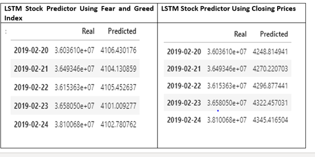

# Deep_Learning_Homework

Brief Summary of Activity

In this assignment, deep learning recurrent neural networks is used to model bitcoin closing prices. One model will use the FNG indicators to predict the closing price while the second model will use a window of closing prices to predict the nth closing price.

In the exercise, we built and trained a custom LSTM RNN that uses a 10 day window of Bitcoin fear and greed index values to predict the 11th day closing price.

For both models, the data was first prepared for testing and training using rolling 10 day window to predict the 11th day closing price. The window_data function was used to generate the X and y values for the model, the data was then split into 70% training and 30% testing. The MinMaxScaler was applied to the X and y values and data for the model was reshaped. 

A custom LSTM RNN was designed and fitted using the training data. Once this was concluded, the model was evaluated using the test data. This was achieved following the following process:

1.	Evaluate the model using the X_test and y_test data.

2.	Use the X_test data to make predictions.

3.	Create a DataFrame of Real (y_test) vs predicted values.

4.	Plot the Real vs predicted values as a line chart.

Below is a snapshot of the real and predicted values for both models
 
 

Here, the following questions were answered:

Which model has a lower loss? LSTM Stock Predictor Using Closing Prices has a lower loss

Which model tracks the actual values better over time? When compared to Real Prices, the LSTM Stock Predictor Using FNG tracked the actual value better over time.

Which window size works best for the model?  After randomly picking window sizes 1,5,8 and 10, I concluded that size 8 works better since the predicted value and the real value are not far apart.
